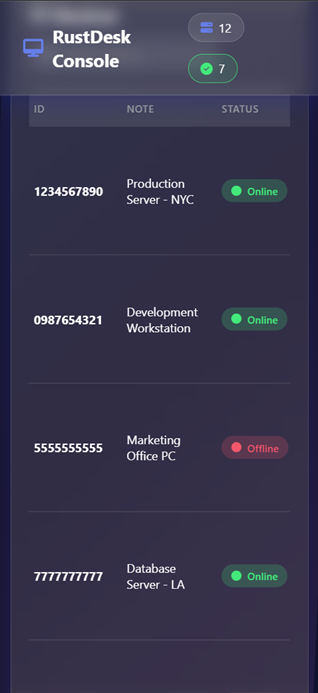

# 🚀 BetterDesk Console

<div align="center">


**A modern, feature-rich web management console for RustDesk with real-time device monitoring and bidirectional ban enforcement**

[Features](#-features) • [Screenshots](#-screenshots) • [Installation](#-installation) • [Documentation](#-documentation) • [Contributing](#-contributing)

</div>

---

## 📋 Table of Contents

- [Overview](#-overview)
- [Features](#-features)
- [Screenshots](#-screenshots)
- [Architecture](#-architecture)
- [Installation](#-installation)
  - [Automatic Installation](#automatic-installation)
  - [Manual Installation](#manual-installation)
- [Configuration](#-configuration)
- [API Documentation](#-api-documentation)
- [Development](#-development)
- [Technology Stack](#-technology-stack)
- [Contributing](#-contributing)
- [License](#-license)
- [Credits](#-credits)

---

## 🌟 Overview

**BetterDesk Console** is an enhanced web management interface for [RustDesk](https://github.com/rustdesk/rustdesk) - the open-source remote desktop solution. It extends the standard RustDesk HBBS (HBB Signal Server) with a powerful HTTP API and provides a beautiful, modern web interface for managing your RustDesk infrastructure.

### Why BetterDesk Console?

- **Real-Time Monitoring**: See which devices are online/offline instantly
- **Beautiful UI**: Modern glassmorphism design with Material Icons
- **Authentic Status Detection**: Uses the same algorithm as RustDesk desktop client
- **RESTful API**: Easy integration with other tools and scripts
- **Device Management**: Add notes, search, filter, and organize your devices
- **Open Source**: Fully transparent and customizable

---

## ✨ Features

### 🎨 Modern Web Interface

- **Glassmorphism Design**: Sleek, modern UI with blur effects and gradients
- **Material Icons**: Google Material Design icons (fully offline)
- **Responsive Layout**: Works on desktop, tablet, and mobile
- **Dark Theme**: Easy on the eyes, perfect for NOC environments
- **Real-Time Updates**: Auto-refresh device status
- **Search & Filter**: Quickly find devices in large deployments

### 🔧 Enhanced HBBS Server

- **HTTP API**: RESTful API on port 21114 (configurable)
- **Real-Time Status**: Memory-based device status (no database lag)
- **Authentic Algorithm**: Uses RustDesk's official 30-second timeout logic
- **Thread-Safe**: Shared PeerMap with Arc/RwLock for concurrent access
- **Zero Breaking Changes**: Fully compatible with existing RustDesk clients
- **CORS Support**: Easy web console integration
- **🔥 Bidirectional Ban Enforcement (v8)**: 
  - Prevents banned devices from initiating connections (source check)
  - Prevents connections to banned devices (target check)
  - Works for both P2P and relay connections
  - Real-time database sync - no restart required

### 📊 Device Management

- **Dashboard View**: Overview with statistics cards (Total, Active, Inactive, Banned, With Notes)
- **Device List**: Sortable table with ID, notes, status, and timestamps
- **Device Details**: View complete device information including ban status
- **Add Notes**: Label devices with custom descriptions
- **🔒 Device Banning**: Ban/unban devices with reason tracking and administrator info
  - **Bidirectional Enforcement (v8)**: Banned devices blocked in both directions
  - Source ban: Banned device cannot initiate any connections
  - Target ban: Cannot connect to banned devices
  - Enforced at punch hole and relay request stages
  - 100% reliability with real-time sync
- **Soft Delete**: Devices marked as deleted (recoverable) instead of permanent removal
- **Batch Operations**: Search and filter multiple devices
- **Public Key Display**: Quick access to server public key
- **Visual Indicators**: Color-coded status badges, banned device highlighting

### 🛡️ Security & Reliability

- **Input Validation**: Comprehensive validation for all user inputs
- **XSS Protection**: Sanitization of user-provided content
- **SQL Injection Prevention**: Parameterized queries throughout
- **Bidirectional Ban Enforcement (v8)**: 
  - Source device ban check (prevents banned devices from connecting)
  - Target device ban check (prevents connections to banned devices)
  - No race conditions or timing vulnerabilities
  - Minimal performance impact (~1ms per check)
- **Ban Management**: Track who banned devices, when, and why
- **Confirmation Dialogs**: Explicit confirmation for destructive operations
- **Automatic Backups**: Installation and update scripts create safety backups
- **Precompiled Binaries**: No compilation needed, faster deployment
- **Service Management**: Systemd integration for auto-restart
- **Graceful Degradation**: Web console works even if API is unavailable
- **No External Dependencies**: All assets served locally (offline-ready)
- **Audit Trail**: Timestamps for all device modifications

---

## 📸 Screenshots

### Dashboard Overview

*Real-time statistics and device status overview*

### Device Management

*Comprehensive device list with search and filtering*

### Device Details

*Detailed device information modal*

### Mobile Responsive

*Fully responsive design for mobile devices*

---

## 🏗️ Architecture

```
┌─────────────────────────────────────────────────────────┐
│                   RustDesk Clients                      │
│              (Desktop, Mobile, Web)                      │
└──────────────────────┬──────────────────────────────────┘
                       │ Heartbeat (~30-45s)
                       ▼
         ┌─────────────────────────────┐
         │   Enhanced HBBS Server      │
         │   (Port 21115-21119)        │
         └──────────┬──────────────────┘
                    │
                    ▼
         ┌─────────────────────────────┐
         │   Arc<PeerMap>              │
         │   (Shared Memory)           │
         │   • In-memory peer storage  │
         │   • last_reg_time tracking  │
         └──────────┬──────────────────┘
                    │
         ┌──────────┴──────────┐
         ▼                     ▼
┌────────────────┐   ┌─────────────────┐
│  HTTP API      │   │  SQLite DB      │
│  (Port 21114)  │   │  (Persistence)  │
└────────┬───────┘   └─────────────────┘
         │
         ▼
┌─────────────────────────────┐
│   Web Management Console    │
│   (Flask on Port 5000)      │
│   • Dashboard               │
│   • Device Management       │
│   • Statistics              │
└─────────────────────────────┘
```

### Key Components

1. **Enhanced HBBS**: Modified RustDesk signal server with HTTP API
2. **HTTP API**: Axum-based REST API for device queries
3. **PeerMap**: Thread-safe in-memory peer storage (Arc<RwLock>)
4. **Web Console**: Flask application with modern UI
5. **SQLite Database**: Original RustDesk database (unchanged)

---

## 🚀 Installation

### Prerequisites

- **Operating System**: Linux (Ubuntu 20.04+, Debian 11+, CentOS 8+)
- **Existing RustDesk**: Working RustDesk HBBS installation (optional - can be fresh install)
- **Dependencies**: python3, pip3, curl, systemd
- **No Compilation Required**: Uses precompiled binaries

### New Installation

For fresh installations or upgrades, use the main installer:

```bash
# Clone the repository
git clone https://github.com/UNITRONIX/Rustdesk-FreeConsole.git
cd Rustdesk-FreeConsole

# Make the installer executable
chmod +x install.sh

# Run as root (creates backup automatically)
sudo ./install.sh
```

**Installation takes approximately 2-3 minutes** (using precompiled binaries).

### Updating to v8

If you already have BetterDesk Console installed, use the update scripts:

#### Linux (Direct Update)

```bash
# Navigate to project directory
cd Rustdesk-FreeConsole

# Make update script executable
chmod +x update.sh

# Run with sudo
sudo ./update.sh
```

#### Windows (Remote Update via SSH)

```powershell
# Navigate to project directory
cd Rustdesk-FreeConsole

# Run update script
.\update.ps1 -RemoteHost YOUR_SERVER_IP -RemoteUser YOUR_SSH_USER
```

**See [UPDATE_GUIDE.md](UPDATE_GUIDE.md) for detailed update instructions, troubleshooting, and rollback procedures.**

### What's New in v1.1.0

- **Device Banning System**: Ban/unban devices with reason tracking
- **Soft Delete**: Devices marked as deleted instead of permanent removal
- **Enhanced Security**: Input validation, XSS protection, SQL injection prevention
- **Improved UI**: Visual ban indicators, new statistics card, confirmation dialogs

---

## ⚙️ Configuration

### HBBS API Port

Default: `21114`

To change, edit `/etc/systemd/system/rustdesksignal.service`:
```ini
ExecStart=/opt/rustdesk/hbbs -k _ -p 21115 --api-port 21115
```

### Web Console Port

Default: `5000`

To change, edit `/opt/BetterDeskConsole/app.py`:
```python
app.run(host='0.0.0.0', port=5000)
```

### Firewall Configuration

```bash
# Allow web console (if needed externally)
sudo ufw allow 5000/tcp

# HBBS API (usually internal only)
sudo ufw allow 21114/tcp
```

---

## 📚 API Documentation

### Base URL
```
http://localhost:21114/api
```

### Endpoints

#### Health Check
```http
GET /api/health
```

**Response**:
```json
{
  "success": true,
  "data": "RustDesk API is running",
  "error": null
}
```

#### List All Peers
```http
GET /api/peers
```

**Response**:
```json
{
  "success": true,
  "data": [
    {
      "id": "1234567890",
      "note": "Production Server",
      "online": true
    },
    {
      "id": "9876543210",
      "note": null,
      "online": false
    }
  ],
  "error": null
}
```

### Status Detection Algorithm

A device is considered **online** if:
1. It exists in the `PeerMap` (in-memory storage)
2. Last registration time is less than **30 seconds** ago

```rust
const REG_TIMEOUT: i32 = 30_000; // milliseconds

online = peer_exists && (last_reg_time.elapsed() < REG_TIMEOUT)
```

This is the **exact same algorithm** used by RustDesk desktop client.

---

## 🛠️ Development

### Running Demo Version (Mock Data)

For screenshots or testing without real devices:

```bash
cd web
python3 app_demo.py
```

Access at: `http://localhost:5001`

### Project Structure

```
BetterDeskConsole/
├── README.md                    # This file
├── LICENSE                      # MIT License
├── install.sh                   # Automatic installer
├── screenshots/                 # UI screenshots
│   ├── dashboard.png
│   ├── devices-list.png
│   ├── device-details.png
│   └── mobile-view.png
├── web/                         # Web console
│   ├── app.py                   # Flask application
│   ├── app_demo.py              # Demo with mock data
│   ├── requirements.txt         # Python dependencies
│   ├── betterdesk.service       # Systemd service file
│   ├── templates/
│   │   └── index.html           # Main HTML template
│   └── static/
│       ├── style.css            # Glassmorphism CSS
│       ├── script.js            # Frontend JavaScript
│       └── material-icons.woff2 # Material Icons font
└── hbbs-patch/                  # HBBS modifications
    ├── README.md                # Patch documentation
    └── src/
        ├── http_api.rs          # HTTP API server (NEW)
        ├── main.rs              # Modified entry point
        ├── peer.rs              # Modified PeerMap
        └── rendezvous_server.rs # Modified server logic
```

### Building from Source

```bash
# Clone RustDesk server
git clone https://github.com/rustdesk/rustdesk-server.git
cd rustdesk-server

# Copy patched files
cp ../hbbs-patch/src/* src/

# Add dependencies
cargo add axum --features "http1,json,tokio"
cargo add tower-http --features "cors"
cargo add tokio --features "full"

# Build
cargo build --release --bin hbbs
```

### Running Tests

```bash
# Test HBBS API
curl http://localhost:21114/api/health

# Test Web Console
curl http://localhost:5000

# Check services
sudo systemctl status rustdesksignal.service
sudo systemctl status betterdesk.service
```

---

## 🎨 Technology Stack

### Backend

- **[RustDesk HBBS](https://github.com/rustdesk/rustdesk-server)**: Original signal server (AGPL-3.0)
- **[Rust](https://www.rust-lang.org/)**: Systems programming language
- **[Axum](https://github.com/tokio-rs/axum)**: Web framework for Rust
- **[Tokio](https://tokio.rs/)**: Async runtime for Rust
- **[Flask](https://flask.palletsprojects.com/)**: Python web framework
- **[SQLite](https://www.sqlite.org/)**: Database (RustDesk original)

### Frontend

- **HTML5**: Semantic markup
- **CSS3**: Glassmorphism effects, animations, gradients
- **JavaScript (ES6+)**: Dynamic UI updates
- **[Material Icons](https://fonts.google.com/icons)**: Icon set (offline)

### DevOps

- **Systemd**: Service management
- **Bash**: Installation scripting
- **Git**: Version control

---

## 🤝 Contributing

Contributions are welcome! Here's how you can help:

### Reporting Issues

- Use the [GitHub Issues](https://github.com/UNITRONIX/Rustdesk-FreeConsole/issues) page
- Include system info (OS, RustDesk version, etc.)
- Provide logs from systemd: `journalctl -u betterdesk.service`

### Pull Requests

1. Fork the repository
2. Create a feature branch: `git checkout -b feature/amazing-feature`
3. Commit your changes: `git commit -m 'Add amazing feature'`
4. Push to the branch: `git push origin feature/amazing-feature`
5. Open a Pull Request

### Development Guidelines

- Follow existing code style
- Update documentation for new features
- Test with real RustDesk clients
- Ensure backward compatibility

---

## 📄 License

This project is licensed under the **MIT License** - see the [LICENSE](LICENSE) file for details.

**Note**: The HBBS patches maintain RustDesk's original **AGPL-3.0** license. The web console and installation scripts are MIT licensed.

---

## 🙏 Credits

### Open Source Components

- **[RustDesk](https://github.com/rustdesk/rustdesk)**: The amazing open-source remote desktop solution
- **[RustDesk Server](https://github.com/rustdesk/rustdesk-server)**: Original HBBS and HBBR servers
- **[Axum](https://github.com/tokio-rs/axum)**: Modern web framework for Rust
- **[Flask](https://flask.palletsprojects.com/)**: Micro web framework for Python
- **[Material Icons](https://fonts.google.com/icons)**: Google's Material Design icons
- **[Font Awesome](https://fontawesome.com/)**: Icon inspiration (not used in final version)

### Inspiration

- RustDesk's simple yet powerful architecture
- Modern web design trends (glassmorphism, neumorphism)
- NOC (Network Operations Center) monitoring dashboards

### Special Thanks

- RustDesk development team for creating an excellent open-source alternative
- The Rust community for amazing tools and libraries
- Contributors and testers who helped improve this project

---

## 📞 Support

- **Documentation**: Check the [docs/](docs/) folder
- **Issues**: [GitHub Issues](https://github.com/UNITRONIX/Rustdesk-FreeConsole/issues)
- **Discussions**: [GitHub Discussions](https://github.com/UNITRONIX/Rustdesk-FreeConsole/discussions)
- **RustDesk Community**: [RustDesk Discord](https://discord.gg/nDceKgxnkV)

---

## 🗺️ Roadmap

### Known Limitations (v1.0.0)
- **Device ID Modification**: Changing device IDs is not recommended and may cause access issues
  - **Workaround**: Use the Note field to assign custom names/labels
- **Device Deletion**: Delete functionality is currently unstable
  - **Status**: Under investigation, fix planned for v1.0.1
- **No Authentication**: Web console has no user authentication (suitable for internal networks only)

### Version 1.0.1 (Bug Fixes - In Progress)
- [ ] Fix device deletion functionality
- [ ] Improve device ID change handling
- [ ] Add confirmation dialogs for destructive operations
- [ ] Better error messages for failed operations

### Version 1.1 (Planned)
- [ ] Multi-language support (i18n)
- [ ] User authentication system
- [ ] Role-based access control (RBAC)
- [ ] Connection history logs
- [ ] Performance metrics dashboard

### Version 1.2 (Future)
- [ ] Mobile app (React Native)
- [ ] WebSocket for real-time updates
- [ ] Device grouping and tagging
- [ ] Scheduled maintenance windows
- [ ] Email/Slack notifications
- [ ] REST API authentication (JWT)

### Version 2.0 (Vision)
- [ ] Multi-server support
- [ ] High availability (HA) setup
- [ ] Advanced analytics
- [ ] Custom themes
- [ ] Plugin system

---

## 🌐 Links

- **GitHub**: https://github.com/UNITRONIX/Rustdesk-FreeConsole
- **RustDesk**: https://rustdesk.com/
- **RustDesk GitHub**: https://github.com/rustdesk/rustdesk

---

## 📚 Documentation

### Core Documentation
- **[README.md](README.md)** - This file (overview and installation)
- **[LICENSE](LICENSE)** - MIT License
- **[VERSION](VERSION)** - Current version number

### Additional Documentation ([docs/](docs/))
- **[CHANGELOG.md](docs/CHANGELOG.md)** - Complete version history
- **[CONTRIBUTING.md](docs/CONTRIBUTING.md)** - How to contribute
- **[DEPRECATION_NOTICE.md](docs/DEPRECATION_NOTICE.md)** - Deprecated features info
- **[RELEASE_NOTES_v1.2.0.md](docs/RELEASE_NOTES_v1.2.0.md)** - Latest release notes
- **[UPDATE_GUIDE.md](docs/UPDATE_GUIDE.md)** - Update instructions
- **[DEVELOPMENT_ROADMAP.md](docs/DEVELOPMENT_ROADMAP.md)** - Future plans

### Technical Documentation
- **[hbbs-patch/](hbbs-patch/)** - HBBS modification documentation
- **[deprecated/](deprecated/)** - Old components (not recommended)
- **[dev_modules/](dev_modules/)** - Development and testing tools

---

<div align="center">

**Made with ❤️ by the community**

If you find this project useful, please consider giving it a ⭐ on GitHub!

[⬆ Back to Top](#-betterdesk-console)

</div>
