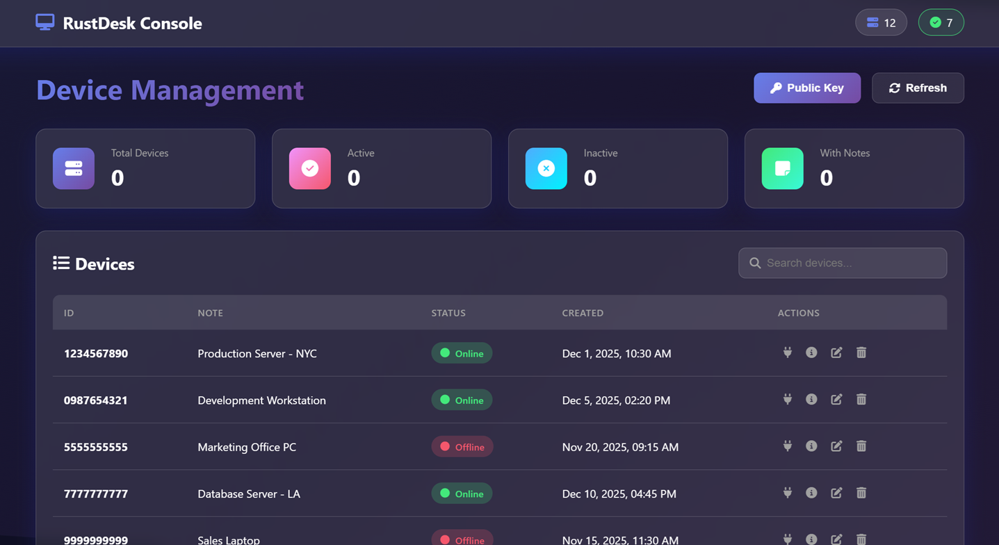
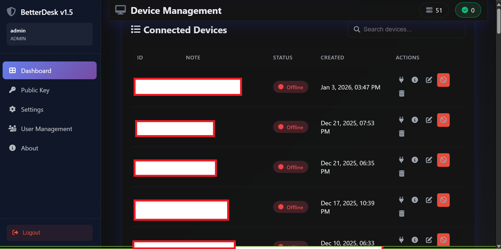
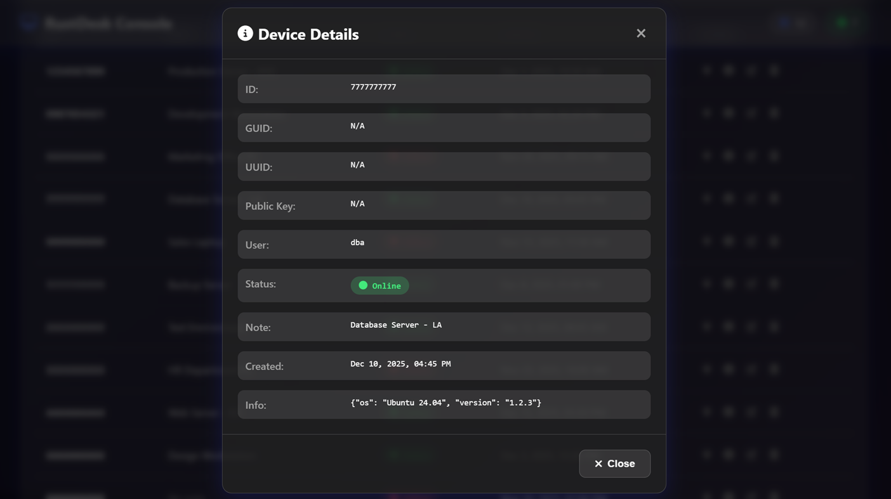
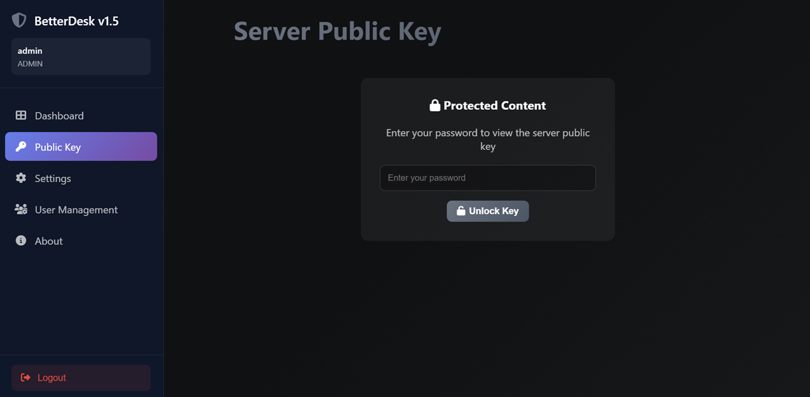
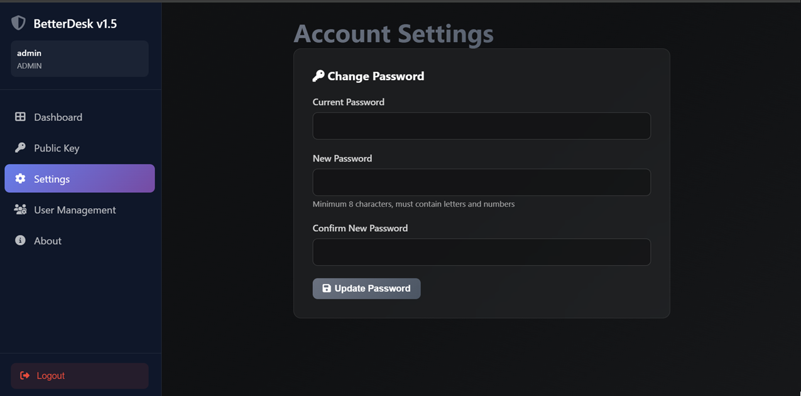
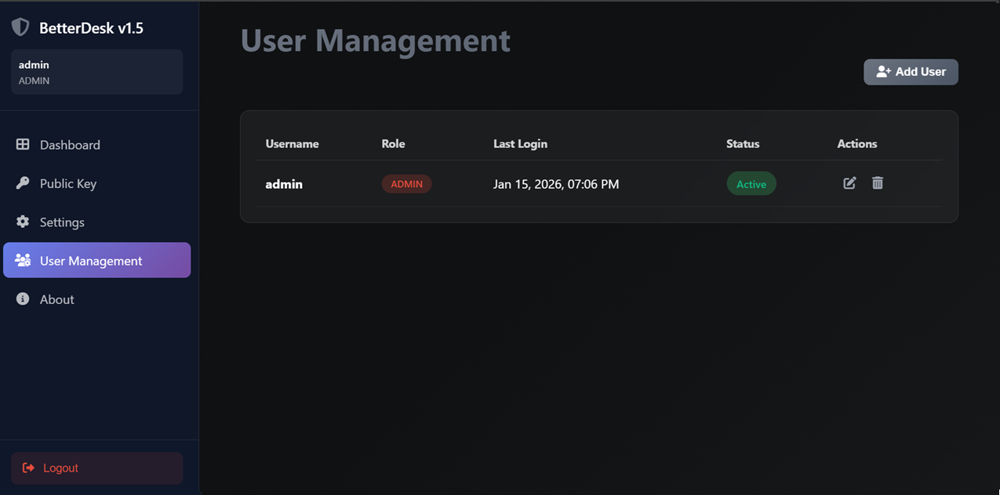
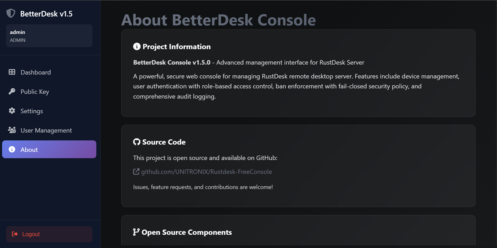

# 🚀 BetterDesk Console

<div align="center">


**A modern, feature-rich web management console for RustDesk with real-time device monitoring and bidirectional ban enforcement**

[Features](#-features) • [Screenshots](#-screenshots) • [Installation](#-installation) • [Documentation](#-documentation) • [Contributing](#-contributing)

</div>

---

## 📋 Table of Contents

- [Quick Start](#-quick-start)
- [Overview](#-overview)
- [Features](#-features)
- [Screenshots](#-screenshots)
- [Architecture](#-architecture)
- [Installation](#-installation)
  - [Linux](#-linux-betterdesk-sh)
  - [Windows](#-windows-betterdeskps1)
  - [Docker](#-docker-betterdesk-dockersh)
- [Internationalization](#-internationalization-i18n)
- [Troubleshooting](#-troubleshooting)
- [Configuration](#-configuration)
- [API Documentation](#-api-documentation)
- [Development](#-development)
- [Technology Stack](#-technology-stack)
- [Contributing](#-contributing)
- [License](#-license)
- [Credits](#-credits)

---

## 🚀 Quick Start

**BetterDesk 2.0** introduces new interactive ALL-IN-ONE scripts for managing installation.

### Linux
```bash
git clone https://github.com/UNITRONIX/Rustdesk-FreeConsole.git
cd Rustdesk-FreeConsole
chmod +x betterdesk.sh
sudo ./betterdesk.sh
```

### Windows (PowerShell as Administrator)
```powershell
git clone https://github.com/UNITRONIX/Rustdesk-FreeConsole.git
cd Rustdesk-FreeConsole
.\betterdesk.ps1
```

### Docker
```bash
git clone https://github.com/UNITRONIX/Rustdesk-FreeConsole.git
cd Rustdesk-FreeConsole
chmod +x betterdesk-docker.sh
./betterdesk-docker.sh
```

**All scripts offer an interactive menu with options:**
1. 🚀 Fresh Installation
2. ⬆️ Update  
3. 🔧 Repair Installation
4. ✅ Validate Installation
5. 💾 Backup
6. 🔐 Reset Admin Password
7. 🔨 Build Binaries
8. 📊 Diagnostics
9. 🗑️ Uninstall
S. ⚙️ Settings (path configuration)

---

## 🌟 Overview

**BetterDesk Console** is an enhanced web management interface for [RustDesk](https://github.com/rustdesk/rustdesk) - the open-source remote desktop solution. It extends the standard RustDesk HBBS (HBB Signal Server) with a powerful HTTP API and provides a beautiful, modern web interface for managing your RustDesk infrastructure.

> **🤖 AI-Assisted Development**: This project was developed with significant assistance from AI coding tools (Claude/GitHub Copilot). While all code has been reviewed, tested, and validated for production use, users should be aware of this development approach.

### Why BetterDesk Console?

- **Real-Time Monitoring**: See which devices are online/offline instantly
- **Beautiful UI**: Modern glassmorphism design with Material Icons
- **Authentic Status Detection**: Uses the same algorithm as RustDesk desktop client
- **RESTful API**: Easy integration with other tools and scripts
- **Device Management**: Add notes, search, filter, and organize your devices
- **Open Source**: Fully transparent and customizable

---

## ✨ Features

### 🎨 Modern Web Interface

- **Glassmorphism Design**: Sleek, modern UI with blur effects and gradients
- **Material Icons**: Google Material Design icons (fully offline)
- **Responsive Layout**: Works on desktop and tablet
- **Dark Theme**: Easy on the eyes, perfect for NOC environments
- **Real-Time Updates**: Auto-refresh device status
- **Search & Filter**: Quickly find devices in large deployments

### 🔧 Enhanced HBBS Server

- **HTTP API**: RESTful API on port 21120 with X-API-Key authentication (LAN accessible)
- **Real-Time Status**: Memory-based device status (no database lag)  
- **Database Fallback**: Web console automatically falls back to SQLite database when API unavailable
- **Smart Status Detection**: HBBS automatically updates device status in database during connections
- **Authentic Algorithm**: Uses RustDesk's official 30-second timeout logic
- **Thread-Safe**: Shared PeerMap with Arc/RwLock for concurrent access
- **Zero Breaking Changes**: Fully compatible with existing RustDesk clients
- **CORS Support**: Easy web console integration
- **🔥 Bidirectional Ban Enforcement (v8)**: 
  - Prevents banned devices from initiating connections (source check)
  - Prevents connections to banned devices (target check)
  - Works for both P2P and relay connections
  - Real-time database sync - no restart required

### 📊 Device Management

- **Dashboard View**: Overview with statistics cards (Total, Active, Inactive, Banned, With Notes)
- **Device List**: Sortable table with ID, notes, status, and timestamps
- **Device Details**: View complete device information including ban status
- **Add Notes**: Label devices with custom descriptions
- **🔒 Device Banning**: Ban/unban devices with reason tracking and administrator info
  - **Bidirectional Enforcement (v8)**: Banned devices blocked in both directions
  - Source ban: Banned device cannot initiate any connections
  - Target ban: Cannot connect to banned devices
  - Enforced at punch hole and relay request stages
  - 100% reliability with real-time sync
- **Soft Delete**: Devices marked as deleted (recoverable) instead of permanent removal
- **Batch Operations**: Search and filter multiple devices
- **Public Key Display**: Quick access to server public key
- **Visual Indicators**: Color-coded status badges, banned device highlighting

### 🔧 Client Generator (UNDER DEVELOPMENT)

> **⚠️ STATUS: IN DEVELOPMENT - NOT YET FUNCTIONAL**  
> This feature is currently under active development and is not ready for production use. The UI is accessible but the functionality is not yet implemented. Expected completion: TBD.

**Planned features:**
- **🚀 Custom RustDesk Client Builder**: Generate pre-configured RustDesk clients directly from the web panel
- **Multi-Platform Support**: Windows (64/32-bit), Linux, Android, macOS
- **Version Selection**: Choose from multiple RustDesk versions (1.4.2 - 1.4.5)
- **Pre-Configuration**: Embed server settings, security options, and permissions
- **Visual Customization**: Upload custom icons and logos
- **Security Options**: Set permanent passwords, approve modes, LAN discovery
- **Permission Control**: Granular control over features (clipboard, file transfer, audio, etc.)
- **Branding**: Custom company name, URLs, and copyright information
- **Code Changes**: Optional modifications (monitor cycling, offline indicators, version notifications)
- **One-Click Deployment**: Download ready-to-deploy clients with all settings embedded
- **Audit Logging**: All client generations are logged for security tracking

See [Client Generator Documentation](docs/CLIENT_GENERATOR.md) for planned feature details.

### 🛡️ Security & Reliability

- **Authentication System (v1.5.0)**:
  - User login with bcrypt password hashing
  - Role-based access control (Admin, Operator, Viewer)
  - Session management with 24-hour tokens
  - **\ud83c\udf10 Sidebar navigation** with 5 main sections (Dashboard, Public Key, Settings, User Management, About)
  - **\ud83d\udd11 Password-protected public key access** - requires password verification
  - **\u2699\ufe0f Settings page** with password change functionality
  - **\ud83d\udc65 User management panel** (admin only) - create, edit, delete, activate/deactivate users
  - **\ud83d\udcdd Extended About page** with open source credits and license information
  - Audit logging for all actions
- **API Security (v1.4.0)**:
  - X-API-Key header authentication for HBBS API
  - 64-character random API keys
  - Secure key storage with 600 permissions
  - LAN accessible (0.0.0.0) with authentication protection
- **Input Validation**: Comprehensive validation for all user inputs
- **XSS Protection**: Sanitization of user-provided content
- **SQL Injection Prevention**: Parameterized queries throughout
- **Bidirectional Ban Enforcement (v8)**: 
  - Source device ban check (prevents banned devices from connecting)
  - Target device ban check (prevents connections to banned devices)
  - No race conditions or timing vulnerabilities
  - Minimal performance impact (~1ms per check)
- **Ban Management**: Track who banned devices, when, and why
- **Confirmation Dialogs**: Explicit confirmation for destructive operations
- **Automatic Backups**: Installation and update scripts create safety backups
- **Precompiled Binaries**: No compilation needed, faster deployment
- **Service Management**: Systemd integration for auto-restart
- **Graceful Degradation**: Web console works even if API is unavailable
- **No External Dependencies**: All assets served locally (offline-ready)
- **Audit Trail**: Timestamps for all device modifications

### 🌍 Internationalization (i18n)

BetterDesk Console supports multiple languages through a JSON-based translation system.

**Features:**
- **Auto-Detection**: Automatically detects browser language preference
- **Manual Selection**: Change language via Settings → Language Settings
- **Persistent**: Language preference saved in cookies (1 year)
- **Community Translations**: Easy to add new languages via JSON files
- **Custom Upload**: Upload your own language packs directly from the web panel

**Built-in Languages:**
- 🇬🇧 English (default)
- 🇵🇱 Polish (Polski)

**Adding a Custom Language:**
1. Go to **Settings** → **Language Settings**
2. Click **Choose JSON File** and select your translation file
3. The language will be available immediately after upload
4. Refresh the page to apply translations

**Creating a Language Pack:**
1. Copy `web/lang/en.json` to `web/lang/[code].json`
2. Translate all string values
3. Update the `_meta` section with language info
4. Upload via the web panel or place in the `lang/` folder

See [Contributing Translations](docs/CONTRIBUTING_TRANSLATIONS.md) for detailed instructions.

---

## 📸 Screenshots

### Dashboard Overview

*Real-time statistics and device status overview*

### Device Management

*Comprehensive device list with search and filtering*

### Device Details

*Detailed device information modal*

### Public Key Management

*Secure public key access with password protection*

### Settings

*User settings and password management*

### User Management

*Multi-user administration panel*

### About

*System information and version details*

---

## 🏗️ Architecture

```
┌─────────────────────────────────────────────────────────┐
│                   RustDesk Clients                      │
│              (Desktop, Tablet, Web)                      │
└──────────────────────┬──────────────────────────────────┘
                       │ Heartbeat (~30-45s)
                       ▼
         ┌─────────────────────────────┐
         │   Enhanced HBBS Server      │
         │   (Port 21115-21119)        │
         └──────────┬──────────────────┘
                    │
                    ▼
         ┌─────────────────────────────┐
         │   Arc<PeerMap>              │
         │   (Shared Memory)           │
         │   • In-memory peer storage  │
         │   • last_reg_time tracking  │
         └──────────┬──────────────────┘
                    │
         ┌──────────┴──────────┐
         ▼                     ▼
┌────────────────┐   ┌─────────────────┐
│  HTTP API      │   │  SQLite DB      │
│  (Port 21120)  │   │  (Persistence)  │
│  (LAN Access)  │   │                 │
└────────┬───────┘   └─────────────────┘
         │
         ▼
┌─────────────────────────────┐
│   Web Management Console    │
│   (Flask on Port 5000)      │
│   • Dashboard               │
│   • Device Management       │
│   • Statistics              │
└─────────────────────────────┘
```

### Key Components

1. **Enhanced HBBS**: Modified RustDesk signal server with HTTP API
2. **HTTP API**: Axum-based REST API for device queries
3. **PeerMap**: Thread-safe in-memory peer storage (Arc<RwLock>)
4. **Web Console**: Flask application with modern UI
5. **SQLite Database**: Original RustDesk database (unchanged)

---

## 🚀 Installation

### 📌 Interactive ALL-IN-ONE Scripts (v2.0 - Recommended)

| Platform | Script | Features |
|----------|--------|----------|
| **Linux** | `betterdesk.sh` | ✅ Interactive menu, install, update, backup, diagnostics, build |
| **Windows** | `betterdesk.ps1` | ✅ Interactive menu, install, update, backup, diagnostics, build |
| **Docker** | `betterdesk-docker.sh` | ✅ Interactive menu, build images, manage containers |

> **💡 New in v2.0**: One script for all operations! Install, update, repair, backup, and diagnose from an interactive menu.

### 🐧 Linux (`betterdesk.sh`)

```bash
git clone https://github.com/UNITRONIX/Rustdesk-FreeConsole.git
cd Rustdesk-FreeConsole
chmod +x betterdesk.sh
sudo ./betterdesk.sh
```

### 🪟 Windows (`betterdesk.ps1`)

```powershell
git clone https://github.com/UNITRONIX/Rustdesk-FreeConsole.git
cd Rustdesk-FreeConsole
.\betterdesk.ps1  # Run as Administrator
```

### 🐳 Docker (`betterdesk-docker.sh`)

```bash
git clone https://github.com/UNITRONIX/Rustdesk-FreeConsole.git
cd Rustdesk-FreeConsole
chmod +x betterdesk-docker.sh
./betterdesk-docker.sh
```

---

### 📜 Legacy Scripts (for advanced users)

| Platform | Script | Features |
|----------|--------|----------|
| **Linux** | `scripts/legacy/install-improved.sh` | Automatic installation without menu |
| **Windows** | `scripts/legacy/install-improved.ps1` | Automatic installation without menu |
| **Docker** | `docker compose build && docker compose up -d` | Manual Docker commands |

> **⚠️ Note**: Legacy scripts are still supported but we recommend using the new ALL-IN-ONE scripts.

### Prerequisites

- **Linux**: Ubuntu 20.04+, Debian 11+, CentOS 8+
- **Windows**: Windows 10+, Windows Server 2016+
- **RustDesk**: Fresh RustDesk installation OR existing working HBBS (script auto-detects)
- **Linux Dependencies**: python3, pip3, curl, systemd
- **Windows Dependencies**: Python 3.8+, PowerShell 5.1+
- **No Compilation Required**: Uses precompiled binaries

> **💡 Fresh Installation Support**: The script now automatically detects if you have RustDesk installed and can perform fresh installations or updates accordingly. No need for separate installation procedures!

### 🐳 Docker Installation (Alternative)

For containerized deployments using Docker Compose:

```bash
git clone https://github.com/UNITRONIX/Rustdesk-FreeConsole.git
cd Rustdesk-FreeConsole

# Build and start (REQUIRED - images are not on Docker Hub)
docker compose build
docker compose up -d
```

> **Note**: Helper scripts like `docker-quickstart.sh` and `install-docker.sh` are provided for convenience but may not include all features. For production, use `docker compose` directly.

**Full Docker guide**: [DOCKER_TROUBLESHOOTING.md](DOCKER_TROUBLESHOOTING.md)

### 🐧 Linux Installation (Primary Method)

```bash
git clone https://github.com/UNITRONIX/Rustdesk-FreeConsole.git
cd Rustdesk-FreeConsole
chmod +x install-improved.sh
sudo ./install-improved.sh
```

**What the script does:**
- ✅ Detects existing RustDesk installation
- ✅ Creates automatic backup
- ✅ Installs BetterDesk enhanced binaries
- ✅ Runs database migration (adds all required columns)
- ✅ Creates authentication tables and admin user
- ✅ Configures systemd services
- ✅ Preserves encryption keys

**Troubleshooting options:**
```bash
sudo ./install-improved.sh --diagnose  # Check for issues
sudo ./install-improved.sh --fix       # Fix offline status problem
```

### 🔄 Updating Existing Installation

```bash
cd Rustdesk-FreeConsole
git pull origin main
sudo ./install-improved.sh  # Auto-detects and updates
```

The script automatically backs up your installation, migrates the database, and preserves all encryption keys.

### Quick Database Fix (if devices show as offline)

> **Note**: The primary installers (`install-improved.sh` / `install-improved.ps1`) now run database migrations automatically. Use these manual steps only if you installed via other methods.

If devices appear offline even though they're connected:

```bash
# Option 1: Use the installer's fix mode (Recommended)
sudo ./install-improved.sh --fix

# Option 2: Run migration script manually
python3 migrations/v1.5.0_fix_online_status.py

# Restart services
sudo systemctl restart hbbs betterdesk
```

### 🪟 Windows Installation (Primary Method)

```powershell
git clone https://github.com/UNITRONIX/Rustdesk-FreeConsole.git
cd Rustdesk-FreeConsole
.\install-improved.ps1  # Run as Administrator
```

**What the script does:**
- ✅ Detects existing RustDesk installation
- ✅ Creates automatic backup
- ✅ Installs BetterDesk enhanced binaries (.exe)
- ✅ Runs database migration (adds all required columns)
- ✅ Creates authentication tables and admin user
- ✅ Installs Web Console to `C:\BetterDeskConsole`

**Troubleshooting options:**
```powershell
.\install-improved.ps1 -Diagnose  # Check for issues
.\install-improved.ps1 -Fix       # Fix offline status problem
```

> **Note**: Windows does not use systemd services. You need to start HBBS/HBBR manually or create scheduled tasks.

### ⚠️ Important: Platform-Specific Binaries

The installers automatically use the correct binaries for your platform:

**Linux x86_64 (v2.0.0 - Recommended):**
- Uses `hbbs-patch-v2/hbbs-linux-x86_64` (pre-compiled)
- Uses `hbbs-patch-v2/hbbr-linux-x86_64` (pre-compiled)
- Features: 15s offline detection, connection pooling, auto-retry, API port 21114

**Windows x86_64 (v2.0.0 - Recommended):**
- Uses `hbbs-patch-v2/hbbs-windows-x86_64.exe` (pre-compiled)
- Uses `hbbs-patch-v2/hbbr-windows-x86_64.exe` (pre-compiled)
- Features: Same as Linux binaries

**Do not mix binaries between platforms!** Each installer is designed to work only on its respective operating system.

### 🔑 Key Protection (IMPORTANT!)

**v1.5.0+ includes comprehensive encryption key protection:**

⚠️ **Your RustDesk encryption keys are CRITICAL!**
- Losing keys = ALL clients disconnected
- Changing keys = "Key mismatch" errors on all devices
- Keys must be backed up before any installation

**BetterDesk v1.5.0+ automatically:**
- ✅ Detects existing encryption keys
- ✅ Scans for ANY `.pub` file (not just `id_ed25519.pub`)
- ✅ Offers multiple backup options (automatic, manual, existing)
- ✅ Warns before any key changes
- ✅ Never regenerates keys without explicit confirmation

**During installation, you'll see:**
```
🔑 EXISTING ENCRYPTION KEYS DETECTED 🔑
Found: id_ed25519.pub

Options:
  1) Keep existing keys (RECOMMENDED)
  2) Regenerate keys (⚠️ BREAKS client connections)
  3) Show key information
```

**Always choose Option 1 unless you know what you're doing!**

**If you experience "Key mismatch" errors:**
```bash
# Restore from automatic backup
BACKUP=$(ls -d /opt/rustdesk-backup-* | sort | tail -1)
sudo cp $BACKUP/id_ed25519* /opt/rustdesk/
sudo systemctl restart rustdesksignal
```

📖 **Full guide**: [docs/KEY_TROUBLESHOOTING.md](docs/KEY_TROUBLESHOOTING.md)

### 🔒 Manual Installation on SSH Server (Security Update)

If you compiled new binaries with security fixes on your SSH server:

```bash
# Upload the manual installation script
scp hbbs-patch/MANUAL_INSTALL.sh your-user@your-server:~/

# SSH to server and run
ssh your-user@your-server
sudo bash ~/MANUAL_INSTALL.sh
```

**The script will:**
1. Stop HBBS/HBBR services
2. Backup old binaries (timestamped)
3. Install new binaries from `~/build/hbbs-patch/rustdesk-server/target/release/`
4. Restart services
5. Verify API is responding on port 21120

---

## 🔧 Troubleshooting

### ⚡ Recent Fixes (31 Jan 2026)

**🐛 Fixed Issues:**
- ✅ **Docker**: "sh: executable file not found" - Added bash to Dockerfile
- ✅ **PowerShell**: "Write-Info is not recognized" - Fixed function naming conflicts
- 📖 **[QUICK_FIX.md](QUICK_FIX.md)** - Quick solutions for reported problems
- 📖 **[TROUBLESHOOTING.md](TROUBLESHOOTING.md)** - Complete troubleshooting guide

---

### 🚨 "The keys do not match" Error

This is the most common issue after installation. **Don't panic!**

**Quick Fix - Restore from backup:**
```bash
# Find most recent backup
BACKUP=$(ls -d /opt/rustdesk-backup-* | sort | tail -1)

# Restore keys
sudo systemctl stop rustdesksignal rustdeskrelay
sudo cp $BACKUP/id_ed25519* /opt/rustdesk/
sudo chmod 600 /opt/rustdesk/id_ed25519
sudo chmod 644 /opt/rustdesk/id_ed25519.pub
sudo systemctl start rustdesksignal rustdeskrelay

# Verify
cat /opt/rustdesk/id_ed25519.pub
```

### 📚 Comprehensive Troubleshooting Guides

- **[QUICK_FIX.md](QUICK_FIX.md)** - Fast solutions for recent user-reported issues
- **[TROUBLESHOOTING.md](TROUBLESHOOTING.md)** - Docker & PowerShell fixes
- **[KEY_TROUBLESHOOTING.md](docs/KEY_TROUBLESHOOTING.md)** - Complete key management guide
- **[UPDATE_GUIDE.md](docs/UPDATE_GUIDE.md)** - Updating existing installations

### 🔧 Key Permission Issues

If you experience key permission problems, fix them manually:

```bash
# Set correct permissions for encryption keys
sudo chmod 600 /opt/rustdesk/id_ed25519
sudo chmod 644 /opt/rustdesk/id_ed25519.pub

# Restart services
sudo systemctl restart rustdesksignal rustdeskrelay betterdesk

# Verify public key is readable
cat /opt/rustdesk/id_ed25519.pub
```

### 🐳 Docker Issues

**Problem**: "Docker RustDesk installation detected" message

**Solutions:**
1. **Use Docker-compose** (recommended for Docker setups)
2. **Install web console only** (option 2 during installation)
3. **Continue with native installation** (if intentional)

#### 🔑 Missing Admin Login Credentials (Docker Compose)

**Problem**: After running `docker compose up -d`, the console doesn't show admin credentials.

**Quick Fix - Use the fix script:**

```bash
# Linux/macOS
chmod +x fix-admin.sh
./fix-admin.sh

# Windows
fix-admin.bat
```

**Or set custom credentials in `docker-compose.yml`:**

```yaml
environment:
  - ADMIN_USERNAME=admin
  - ADMIN_PASSWORD=YourSecurePassword123
```

**Manual option (if scripts don't work):**

```bash
# Run migration in container
docker compose exec betterdesk-console python3 -c "
import sqlite3, secrets, bcrypt
from datetime import datetime

DB_PATH, USERNAME = '/opt/rustdesk/db_v2.sqlite3', 'admin'
PASSWORD = secrets.token_urlsafe(12)
conn = sqlite3.connect(DB_PATH)
cursor = conn.cursor()

# Create tables
cursor.execute('CREATE TABLE IF NOT EXISTS users (id INTEGER PRIMARY KEY AUTOINCREMENT, username VARCHAR(50) UNIQUE NOT NULL, password_hash TEXT NOT NULL, role VARCHAR(20) NOT NULL DEFAULT \"viewer\", created_at DATETIME NOT NULL, last_login DATETIME, is_active BOOLEAN NOT NULL DEFAULT 1, CHECK (role IN (\"admin\", \"operator\", \"viewer\")))')

# Create admin if missing
cursor.execute('SELECT id FROM users WHERE username = ?', (USERNAME,))
if not cursor.fetchone():
    password_hash = bcrypt.hashpw(PASSWORD.encode(), bcrypt.gensalt()).decode()
    cursor.execute('INSERT INTO users (username, password_hash, role, created_at, is_active) VALUES (?, ?, \"admin\", ?, 1)', (USERNAME, password_hash, datetime.now()))
    print(f'🔐 Username: {USERNAME}\\nPassword: {PASSWORD}\\n⚠️  Change after login!')
else:
    print('ℹ️  Admin user already exists')

conn.commit()
conn.close()
"
```

---

**After using any option above:**
1. 🌐 Open: http://localhost:5000
2. 🔑 Login with the displayed/chosen credentials  
3. ⚠️ **Immediately change password** in settings!

**Detailed Docker troubleshooting guide**: [DOCKER_TROUBLESHOOTING.md](DOCKER_TROUBLESHOOTING.md)

### Common Issues & Solutions

| Symptom | Cause | Solution |
|---------|-------|----------|
| "Key mismatch" | Keys changed during install | Restore from backup (see Troubleshooting above) |
| Wrong key in WebConsole | Multiple `.pub` files | Remove incorrect files or upgrade to v9+ |
| Services won't start | Permission issues | Fix with: `sudo chmod 600 /opt/rustdesk/id_ed25519` |
| Can't find backups | Skipped backup during install | Check `/opt/rustdesk-backup-*` directories |
| Docker detected | Running RustDesk in container | Choose "Web Console only" option |
| **No admin login (Docker)** | Missing database migration | Run `./fix-admin.sh` or see Docker Issues section |
| **All devices offline** | Missing `last_online` column | Run `python3 migrations/v1.5.0_fix_online_status.py` |
| **API not responding** | Old/wrong binaries | Use v2 binaries from `hbbs-patch-v2/` (port 21120) |
| **Update script not found** | Old version cloned | Run `git pull` to get latest files |
| **Connect button not working** | Custom RustDesk client | Set custom scheme via browser console (see below) |
| **"no such table: peer"** | Using original RustDesk binaries | Rebuild Docker: `docker compose build --no-cache` |
| **"pull access denied"** | Images not on Docker Hub | Build locally: `docker compose build && docker compose up -d` |
| **DNS failure in Docker build** | Resolver issues (AlmaLinux/CentOS) | See [DOCKER_TROUBLESHOOTING.md](DOCKER_TROUBLESHOOTING.md#problem-dns-failure-during-build-almalinuxcentos) |

### 🚨 Known Issues (v1.5.0)

#### 1. Devices Show as Offline After Update

**Symptoms:** All devices appear offline in the console, even though they can connect to each other.

**Cause:** Database is missing the `last_online` column required for status detection.

**Solution:**
```bash
# Option 1: Run migration script
python3 migrations/v1.5.0_fix_online_status.py

# Option 2: Add column manually
sqlite3 /opt/rustdesk/db_v2.sqlite3 "ALTER TABLE peer ADD COLUMN last_online TEXT;"
sqlite3 /opt/rustdesk/db_v2.sqlite3 "ALTER TABLE peer ADD COLUMN is_deleted INTEGER DEFAULT 0;"

# Restart services
sudo systemctl restart hbbs betterdesk
```

#### 2. Connect Button Not Working (Custom Clients)

**Symptoms:** Clicking "Connect" does nothing or opens wrong application.

**Cause:** You have a personalized RustDesk client with custom URL scheme.

**Solution:** Set your custom scheme via browser console (F12):
```javascript
// Replace 'mycompany-rustdesk' with your scheme
setCustomScheme('mycompany-rustdesk');

// To revert to default:
clearCustomScheme();
```

#### 3. API Health Endpoint Not Responding

**Symptoms:** Console cannot determine device status, shows connection errors.

**Cause:** Old HBBS binary without API support or using wrong port.

**Solution:**
```bash
# Copy new v2 binary (recommended)
sudo cp hbbs-patch-v2/hbbs-linux-x86_64 /opt/rustdesk/hbbs-v8-api
sudo chmod +x /opt/rustdesk/hbbs-v8-api

# Update service to use new binary
sudo sed -i 's/hbbs/hbbs-v8-api/g' /etc/systemd/system/rustdesksignal.service
sudo systemctl daemon-reload
sudo systemctl restart rustdesksignal

# v2 uses port 21120 (not 21114)
```

#### 4. Installer Cannot Find Installation

**Symptoms:** `install-improved.sh` reports "Installation directory not found"

**Cause:** Non-standard installation path.

**Solution:**
```bash
# Find your installation
find / -name "app.py" 2>/dev/null
find / -name "db_v2.sqlite3" 2>/dev/null

# Run the database fix script
sudo ./dev_modules/check_and_fix_database.sh /path/to/db_v2.sqlite3
```

### 📞 Getting Help

**Before asking for help:**
1. Check the troubleshooting guides above
2. Run the installation script again (it auto-detects and can fix issues): `sudo ./install-improved.sh`
3. Collect diagnostics:
   ```bash
   sudo journalctl -u rustdesksignal -n 50 > ~/rustdesk_logs.txt
   ls -lah /opt/rustdesk/*.pub >> ~/rustdesk_logs.txt
   ```

**Where to get help:**
- 🐛 [GitHub Issues](https://github.com/UNITRONIX/Rustdesk-FreeConsole/issues)
- 📖 [Documentation](docs/)
- 💬 [RustDesk Discussions](https://github.com/rustdesk/rustdesk/discussions)

---

## ⚙️ Configuration

### HBBS API Port

Default: `21120` (LAN accessible with X-API-Key authentication)

**Security (v1.4.0)**: The API now supports LAN access with proper authentication:
- \u2705 Binds to `0.0.0.0:21120` (accessible on LAN)
- \u2705 Requires X-API-Key header for all requests
- \u2705 64-character random API key generated during installation
- \u2705 Key stored securely in `/opt/rustdesk/.api_key` with 600 permissions
- \u2705 Web console automatically uses API key
- \u2705 No authentication = no access (secure by design)

**API Key Location**: `/opt/rustdesk/.api_key`

To change port, edit `/etc/systemd/system/rustdesksignal.service`:
```ini
ExecStart=/opt/rustdesk/hbbs -k _ -p 21115 --api-port 21120
```

### Web Console Port

Default: `5000` (accessible on LAN)

The web console binds to `0.0.0.0:5000` for LAN access and includes:
- User authentication (bcrypt passwords)
- Session management (24-hour tokens)
- Role-based access control
- Audit logging

To change, edit `/opt/BetterDeskConsole/app.py`:
```python
app.run(host='0.0.0.0', port=5000)
```

### Firewall Configuration

```bash
# Allow web console on LAN
sudo ufw allow from 192.168.0.0/16 to any port 5000 proto tcp

# Allow HBBS API on LAN (v2 uses port 21120)
sudo ufw allow from 192.168.0.0/16 to any port 21120 proto tcp

# Standard RustDesk ports
sudo ufw allow 21115/tcp
sudo ufw allow 21116/tcp
sudo ufw allow 21116/udp
sudo ufw allow 21117/tcp
```

---

## 📚 API Documentation

### Base URL
```
http://<server-ip>:21120/api
```

### Authentication

**All API requests require X-API-Key header:**
```bash
curl -H "X-API-Key: YOUR_API_KEY_HERE" http://192.168.1.100:21120/api/health
```

**API Key Location**: `/opt/rustdesk/.api_key`

To retrieve your API key:
```bash
sudo cat /opt/rustdesk/.api_key
```

### Endpoints

#### Health Check
```http
GET /api/health
Headers: X-API-Key: <your-api-key>
```

**Response**:
```json
{
  "success": true,
  "data": "RustDesk API is running",
  "error": null
}
```

#### List All Peers
```http
GET /api/peers
Headers: X-API-Key: <your-api-key>
```

**Response**:
```json
{
  "success": true,
  "data": [
    {
      "id": "1234567890",
      "note": "Production Server",
      "online": true
    },
    {
      "id": "9876543210",
      "note": null,
      "online": false
    }
  ],
  "error": null
}
```

**Error Response (No/Invalid API Key)**:
```json
{
  "error": "Unauthorized: Invalid or missing API key"
}
```
Status Code: 401

### Status Detection Algorithm

A device is considered **online** if:
1. It exists in the `PeerMap` (in-memory storage)
2. Last registration time is less than **30 seconds** ago

```rust
const REG_TIMEOUT: i32 = 30_000; // milliseconds

online = peer_exists && (last_reg_time.elapsed() < REG_TIMEOUT)
```

This is the **exact same algorithm** used by RustDesk desktop client.

---

## 🛠️ Development

### Running Demo Version (Mock Data)

For screenshots or testing without real devices:

```bash
cd web
python3 app_demo.py
```

Access at: `http://localhost:5001`

### Project Structure

```
BetterDeskConsole/
├── README.md                    # This file
├── LICENSE                      # MIT License
├── install.sh                   # Automatic installer
├── screenshots/                 # UI screenshots
│   ├── dashboard.png
│   ├── devices-list.png
│   ├── device-details.png
│   ├── public_key_page.png
│   ├── settings_page.png
│   ├── user_mgmt.png
│   └── about.png
├── web/                         # Web console
│   ├── app.py                   # Flask application
│   ├── app_demo.py              # Demo with mock data
│   ├── requirements.txt         # Python dependencies
│   ├── betterdesk.service       # Systemd service file
│   ├── templates/
│   │   └── index.html           # Main HTML template
│   └── static/
│       ├── style.css            # Glassmorphism CSS
│       ├── script.js            # Frontend JavaScript
│       └── material-icons.woff2 # Material Icons font
└── hbbs-patch/                  # HBBS modifications
    ├── README.md                # Patch documentation
    └── src/
        ├── http_api.rs          # HTTP API server (NEW)
        ├── main.rs              # Modified entry point
        ├── peer.rs              # Modified PeerMap
        └── rendezvous_server.rs # Modified server logic
```

### Building from Source

```bash
# Clone RustDesk server
git clone https://github.com/rustdesk/rustdesk-server.git
cd rustdesk-server

# Copy patched files
cp ../hbbs-patch/src/* src/

# Add dependencies
cargo add axum --features "http1,json,tokio"
cargo add tower-http --features "cors"
cargo add tokio --features "full"

# Build
cargo build --release --bin hbbs
```

### Running Tests

```bash
# Test HBBS API
curl http://localhost:21120/api/health

# Test Web Console
curl http://localhost:5000

# Check services
sudo systemctl status rustdesksignal.service
sudo systemctl status betterdesk.service
```

---

## 🎨 Technology Stack

### Backend

- **[RustDesk HBBS](https://github.com/rustdesk/rustdesk-server)**: Original signal server (AGPL-3.0)
- **[Rust](https://www.rust-lang.org/)**: Systems programming language
- **[Axum](https://github.com/tokio-rs/axum)**: Web framework for Rust
- **[Tokio](https://tokio.rs/)**: Async runtime for Rust
- **[Flask](https://flask.palletsprojects.com/)**: Python web framework
- **[SQLite](https://www.sqlite.org/)**: Database (RustDesk original)

### Frontend

- **HTML5**: Semantic markup
- **CSS3**: Glassmorphism effects, animations, gradients
- **JavaScript (ES6+)**: Dynamic UI updates
- **[Material Icons](https://fonts.google.com/icons)**: Icon set (offline)

### DevOps

- **Systemd**: Service management
- **Bash**: Installation scripting
- **Git**: Version control

---

## 🤝 Contributing

Contributions are welcome! Here's how you can help:

### Reporting Issues

- Use the [GitHub Issues](https://github.com/UNITRONIX/Rustdesk-FreeConsole/issues) page
- Include system info (OS, RustDesk version, etc.)
- Provide logs from systemd: `journalctl -u betterdesk.service`

### Pull Requests

1. Fork the repository
2. Create a feature branch: `git checkout -b feature/amazing-feature`
3. Commit your changes: `git commit -m 'Add amazing feature'`
4. Push to the branch: `git push origin feature/amazing-feature`
5. Open a Pull Request

### Development Guidelines

- Follow existing code style
- Update documentation for new features
- Test with real RustDesk clients
- Ensure backward compatibility

---

## 📄 License

This project is licensed under the **MIT License** - see the [LICENSE](LICENSE) file for details.

**Note**: The HBBS patches maintain RustDesk's original **AGPL-3.0** license. The web console and installation scripts are MIT licensed.

---

## 🙏 Credits

### Open Source Components

- **[RustDesk](https://github.com/rustdesk/rustdesk)**: The amazing open-source remote desktop solution
- **[RustDesk Server](https://github.com/rustdesk/rustdesk-server)**: Original HBBS and HBBR servers
- **[Axum](https://github.com/tokio-rs/axum)**: Modern web framework for Rust
- **[Flask](https://flask.palletsprojects.com/)**: Micro web framework for Python
- **[Material Icons](https://fonts.google.com/icons)**: Google's Material Design icons
- **[Font Awesome](https://fontawesome.com/)**: Icon inspiration (not used in final version)

### Inspiration

- RustDesk's simple yet powerful architecture
- Modern web design trends (glassmorphism, neumorphism)
- NOC (Network Operations Center) monitoring dashboards

### Special Thanks

- RustDesk development team for creating an excellent open-source alternative
- The Rust community for amazing tools and libraries
- Contributors and testers who helped improve this project

---

## 📞 Support

- **Documentation**: Check the [docs/](docs/) folder
- **Issues**: [GitHub Issues](https://github.com/UNITRONIX/Rustdesk-FreeConsole/issues)
- **Discussions**: [GitHub Discussions](https://github.com/UNITRONIX/Rustdesk-FreeConsole/discussions)
- **RustDesk Community**: [RustDesk Discord](https://discord.gg/nDceKgxnkV)

---

## 🌐 Links

- **GitHub**: https://github.com/UNITRONIX/Rustdesk-FreeConsole
- **RustDesk**: https://rustdesk.com/
- **RustDesk GitHub**: https://github.com/rustdesk/rustdesk

---

## 📚 Documentation

### Core Documentation
- **[README.md](README.md)** - This file (overview and installation)
- **[LICENSE](LICENSE)** - MIT License
- **[VERSION](VERSION)** - Current version number

### Additional Documentation ([docs/](docs/))
- **[CHANGELOG.md](docs/CHANGELOG.md)** - Complete version history
- **[CONTRIBUTING.md](docs/CONTRIBUTING.md)** - How to contribute
- **[INSTALLATION_V1.4.0.md](docs/INSTALLATION_V1.4.0.md)** - Detailed installation guide
- **[UPDATE_GUIDE.md](docs/UPDATE_GUIDE.md)** - Update instructions
- **[KEY_TROUBLESHOOTING.md](docs/KEY_TROUBLESHOOTING.md)** - Key troubleshooting guide
- **[PORT_SECURITY.md](docs/PORT_SECURITY.md)** - Port security information
- **[PROJECT_STRUCTURE.md](docs/PROJECT_STRUCTURE.md)** - Project structure overview

### Technical Documentation
- **[hbbs-patch/](hbbs-patch/)** - HBBS modification documentation
- **[dev_modules/](dev_modules/)** - Development and testing tools

---

<div align="center">

**Made with ❤️ by the community**

If you find this project useful, please consider giving it a ⭐ on GitHub!

[⬆ Back to Top](#-betterdesk-console)

</div>
